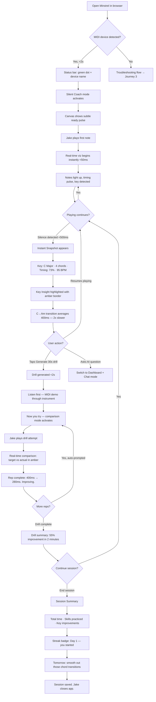
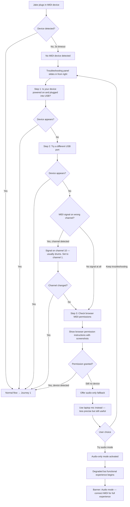
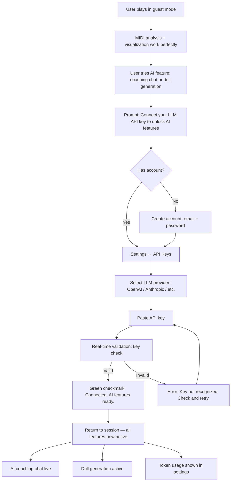

# UX Design Specification Minstrel

**Author:** Melchizedek
**Date:** 2026-02-12

---

## Executive Summary

### Project Vision

Minstrel is a browser-based AI practice companion that listens to musicians play via MIDI, analyzes their performance in real time, and responds with personalized coaching, drills, and adaptive challenge. The experience is ear-first (no sheet music), dynamically generated (no curriculum), and deeply personal (no social features). The Difficulty Engine — a unified AI system governing all challenge in real time — is the core differentiator and critical quality gate.

From a UX perspective, Minstrel is a **professional-grade practice studio** designed for users with **minimal music software experience**. The interface must communicate seriousness and capability while requiring zero learning curve. Feedback is primarily **data-driven and visual** — graphs, meters, timelines, and progress tracking — making performance tangible and improvement visible.

### Target Users

**Jake — The Self-Taught Beginner (15-30)**
Self-taught through YouTube, can play basic chords, lacks structure. Minimal experience with music software. Needs to feel welcomed into a professional space without feeling out of his depth. Success looks like: "I can see exactly what I need to work on, and I can see myself getting better."

**Aisha — The Intermediate Plateau Player (20-45)**
Has formal training, technically competent, stuck at a plateau. Wants depth and understanding. Needs the same interface to reveal layers of insight she can dig into. Success looks like: "I finally understand why things sound the way they do, and I'm breaking through."

**Shared context:** Both users have minimal music software experience (no DAW familiarity). Both expect the app to feel like a professional practice environment — clean, efficient, tools ready — from the moment they open it.

### Key Design Challenges

1. **The Simplicity Paradox** — Professional studio feel for users with no music software experience. The interface must look refined and capable while requiring zero learning curve. Layout and visual hierarchy must be self-teaching.
2. **Three Modes, One Identity** — Silent Coach, Dashboard + Chat, and Replay Studio are distinct interaction paradigms. They must share a cohesive visual language and feel like rooms in the same studio, not separate applications.
3. **The Sheet Music Void** — Removing notation removes the universal visual anchor of music software. A new visual vocabulary for musical performance must be invented using data visualization patterns that communicate without theory knowledge.
4. **Real-Time Without Overwhelm** — 60fps visualization during live play creates constant visual motion. For minimally tech-savvy users, the boundary between engaging and overwhelming must be carefully managed.
5. **Bidirectional MIDI Choreography** — The Demonstrate → Listen → Attempt → Analyze loop is a novel interaction pattern with no established UX precedent. Visual and temporal choreography must make the flow intuitive.

### Design Opportunities

1. **"Strava for Musicians" Data Identity** — Performance data visualization as a core differentiator. Progress charts, session timelines, personal records, and improvement trends give musicians something they've never had — concrete visual proof of growth. High screenshot and share potential.
2. **The Demonstrate → Attempt Loop as Signature Moment** — MIDI playback through the user's own instrument is novel. The visual design of this loop could become Minstrel's iconic, recognizable interaction.
3. **Growth Mindset as Visual Language** — "Not yet" translated into color, motion, and progress representation. Incomplete mastery shown as trajectory toward a goal, never as failure or deficit. Every visual element reinforces forward momentum.

## Core User Experience

### Defining Experience

The core experience of Minstrel is the **live feedback loop** — the musician plays, and the interface responds in real time with visual analysis of their performance. This is the product's heartbeat. Every other feature (coaching, drills, replay, progress tracking) is built around and feeds back into this central interaction.

The defining moment is when a user plays a note and sees Minstrel respond instantly — notes light up, timing pulses, harmonic context appears. This is the "it hears me" moment, and it must happen within the first 10 seconds of the first session. If this moment fails — through lag, confusion, or underwhelming response — the user never returns.

The experience priority stack:

1. **Real-time visualization** — flawless, instant, visually compelling
2. **Zero-friction entry** — MIDI auto-connects, listening auto-starts, warm-ups auto-generate
3. **Invisible intelligence** — Difficulty Engine, session management, and all calibration happen without user configuration
4. **Depth on demand** — advanced features (Dashboard + Chat, Replay Studio) are discoverable layers, never barriers

### Platform Strategy

- **Primary platform:** Desktop web browser (Chrome/Edge) via Web MIDI API
- **Input model:** MIDI instrument as primary input device; mouse/keyboard for navigation and chat only
- **Minimum viewport:** 1024px width; optimized for 1280px+
- **Connection model:** Client-side MIDI processing (no server dependency for core real-time features); server required for AI coaching and drill generation
- **Offline resilience:** Core MIDI analysis and visualization function without network; AI features degrade gracefully with queued sync on reconnection
- **No mobile at MVP:** MIDI instrument connection is desktop-centric; mobile consideration deferred to Phase 2

### Effortless Interactions

The following interactions must require zero user thought or configuration:

| Interaction            | Expected Behavior                                            | User Action Required            |
| ---------------------- | ------------------------------------------------------------ | ------------------------------- |
| MIDI connection        | Auto-detect device on plug-in, green status indicator        | Plug in USB cable               |
| Session start          | Listening begins immediately on first note                   | Play any note                   |
| Warm-up generation     | Auto-generated based on recent work and detected skill level | None — appears on session start |
| Difficulty calibration | Continuous invisible adjustment across all exercises         | None — always automatic         |
| Session recording      | All MIDI data captured from first note to session end        | None — always on                |
| Session save           | Auto-save every 30 seconds, full save on session end         | None — always automatic         |
| Mode context           | Visualizations and data persist across mode switches         | Switch mode freely              |

**Design principle:** If it can be automatic, it must be automatic. The user's only job is to play their instrument.

### Critical Success Moments

| Moment                         | Description                                              | Success Criteria                                               | Failure Consequence                           |
| ------------------------------ | -------------------------------------------------------- | -------------------------------------------------------------- | --------------------------------------------- |
| **First Note Response**        | User plays first note, sees instant visual feedback      | <50ms latency, clear visual response, "it hears me" reaction   | User questions if app is working; leaves      |
| **First Session Snapshot**     | After 2 min of freeform play, Minstrel presents analysis | Accurate key/chord/timing data, one genuinely useful insight   | User sees generic or wrong data; loses trust  |
| **First Drill Cycle**          | Demonstrate → Listen → Attempt → Analyze completed       | Clear visual choreography, measurable improvement shown        | User confused by the flow; doesn't complete   |
| **First "I Didn't Know That"** | AI reveals a playing pattern the user wasn't aware of    | Insight is accurate, specific, and actionable                  | Insight is obvious or incorrect; trust breaks |
| **Return Session**             | User opens Minstrel for second time, sees continuity     | Remembered context, relevant warm-up, progress since last time | Feels like starting over; no stickiness       |

### Experience Principles

1. **"Play First, Everything Else Follows"** — The instrument is the input device. No menus, no setup wizards, no "choose your level." Play a note and the app comes alive. The first interaction is always musical, never administrative.

2. **"Show, Don't Configure"** — No difficulty sliders, no genre pickers, no preference screens. Minstrel observes and adapts. The UI reflects state, never asks for it. Intelligence is demonstrated through behavior, not settings panels.

3. **"The Screen Is Your Second Ear"** — Real-time visualization translates sound into sight. Timing accuracy, harmonic relationships, and playing tendencies become visible. The visualization makes the invisible audible-to-visible, giving musicians the feedback loop they've never had.

4. **"Depth Is a Door, Not a Wall"** — Advanced features exist behind clear affordances but never obstruct the primary experience. Jake sees a clean, clear dashboard. Aisha opens the same dashboard and finds layers of analytical depth. The interface reveals complexity progressively, never demands it upfront.

5. **"Forward Motion, Always"** — Every visual element, every piece of feedback, every metric communicates progress and trajectory. "Not yet" instead of "wrong." Partial mastery shown as distance traveled, not distance remaining. The experience never punishes, only propels.

## Desired Emotional Response

### Primary Emotional Goals

**The Core Feeling: Quiet Confidence**
When a user closes Minstrel, the lingering emotion is calm, grounded certainty: "I got better today. I can feel it." Not hype, not gamified excitement — evidence. The data showed improvement. The drills addressed real weaknesses. The session had purpose. This is the emotional signature that drives daily return.

**The Differentiating Feeling: Being Taken Seriously**
Minstrel treats every musician — beginner or intermediate — as a serious practitioner. The professional studio aesthetic, the data-driven feedback, the technical precision of the AI all communicate: "You're doing real work here." This is the feeling competitors don't provide. Yousician gamifies. YouTube entertains. Minstrel _respects_.

### Emotional Journey Mapping

| Stage                 | Target Emotion         | What Triggers It                                                                                                         |
| --------------------- | ---------------------- | ------------------------------------------------------------------------------------------------------------------------ |
| **App Open**          | Professional readiness | Clean, studio-like interface. Tools ready. No onboarding clutter.                                                        |
| **MIDI Connect**      | Effortless competence  | Instant auto-detection. Green light. "You're connected." Zero friction.                                                  |
| **First Notes**       | Wonder + validation    | Immediate visual response. "It actually hears me." The screen comes alive with their playing.                            |
| **Freeform Play**     | Focused flow           | Minimal UI during play. Silent Coach visualization is ambient, not demanding. The musician forgets the screen and plays. |
| **Session Snapshot**  | Informed curiosity     | Data reveals patterns. "I didn't realize I was doing that." Neutral, specific, accurate.                                 |
| **Drill Cycle**       | Purposeful effort      | Demonstrate → Attempt → Improve. Each rep shows measurable progress. Effort feels directed, not random.                  |
| **Struggle/Failure**  | Guided persistence     | Coach energy: "Almost. Try this instead." Warm, direct, specific. Reframes miss as trajectory.                           |
| **Improvement Shown** | Quiet pride            | Numbers moving in the right direction. No fanfare — just the data, cleanly presented. The achievement speaks for itself. |
| **Session End**       | Quiet confidence       | Summary shows concrete progress. "You improved X by Y% today." Calm certainty that the session mattered.                 |
| **Return Visit**      | Trusted continuity     | Minstrel remembers. Warm-up is relevant. Progress is preserved. Feels like returning to your studio, not starting over.  |

### Micro-Emotions

**Critical Positive Micro-Emotions:**

| Emotion        | Where It Matters                                 | Design Implication                                                                                      |
| -------------- | ------------------------------------------------ | ------------------------------------------------------------------------------------------------------- |
| **Trust**      | AI insights, drill quality, data accuracy        | Precision in language and visualization. Never guess. If the data is uncertain, say so.                 |
| **Competence** | Navigating the interface, understanding feedback | Self-teaching layout. No tooltips needed. Visual hierarchy does the explaining.                         |
| **Momentum**   | Drill progress, session-to-session improvement   | Progress indicators that emphasize trajectory, not position. Show delta, not just current state.        |
| **Curiosity**  | Session snapshots, AI insights, new patterns     | Reveal information progressively. Each insight should open a door to "tell me more."                    |
| **Ownership**  | Progress data, personal records, session history | The data is _theirs_. Personal records, streaks, and improvement charts feel like a musician's logbook. |

**Emotions to Actively Prevent:**

| Emotion         | Risk Trigger                                       | Prevention Strategy                                                                                 |
| --------------- | -------------------------------------------------- | --------------------------------------------------------------------------------------------------- |
| **Shame**       | Displaying errors prominently, comparison language | Growth mindset framing everywhere. "Not yet" instead of "wrong." No red X marks.                    |
| **Overwhelm**   | Too much data, too many options, visual noise      | Progressive disclosure. Silent Coach is minimal. Dashboard adds layers only on request.             |
| **Confusion**   | Unclear feedback, ambiguous visualizations         | Every visual element has one clear meaning. Studio engineer precision in all communication.         |
| **Abandonment** | AI feels generic, feedback feels canned            | Session-aware context in every response. Reference specific notes, specific moments, specific data. |
| **Judgment**    | Scoring systems, rankings, "you failed" language   | No scores. No grades. Only metrics that show trajectory. Personal records, not leaderboards.        |

### Design Implications

**The Studio Engineer AI Persona:**

- Technical, precise, collaborative — speaks about music the way a sound engineer talks about a mix
- Specific references: "your C to Am transition averaged 280ms" not "your transitions could be smoother"
- No filler, no cheerleading, no empty encouragement — every word carries information
- Respects the musician's intelligence regardless of skill level
- Warm when correcting: coach energy surfaces during struggle, then returns to precision

**Quiet Confidence Through Data Design:**

- Progress visualization prioritizes _change over time_ (deltas, trends) over _absolute position_ (scores, levels)
- Achievements are understated — unlocked badges appear cleanly, no confetti explosions
- Session summaries are factual: "Timing accuracy improved 12% this week" not "Great job this week!"
- Personal records feel like athlete stats: precise, personal, worth tracking

**Coach Energy in Failure States:**

- Missed notes and errors shown as data points, not punishments
- Immediate constructive redirect: "Almost — try shifting the voicing down. Listen..." followed by MIDI demonstration
- Reframe every miss in terms of trajectory: "280ms → 180ms over 5 attempts. Closing in."
- Visual feedback for errors uses neutral/warm tones (amber, not red) that communicate "in progress" not "failed"

### Emotional Design Principles

1. **"Earned Confidence, Not Given Praise"** — Minstrel never says "great job" without data to back it up. Confidence comes from seeing real numbers improve, not from empty encouragement. The musician earns the feeling; the UI just makes it visible.

2. **"Precision Is Warmth"** — The most caring thing the AI can do is be _specific_. Generic feedback feels hollow. "Your timing on beat 3 drifts 40ms late when you move to the F chord" is more respectful than "keep working on timing!" Specificity communicates attention.

3. **"The Studio, Not the Classroom"** — Every emotional cue reinforces that this is a professional creative space, not a school. No grades, no tests, no pass/fail. Just a musician, their instrument, and a brilliant engineer who's paying attention.

4. **"Amber, Not Red"** — The visual language for "not yet" uses warm, forward-looking tones. Amber for in-progress, not red for failure. Progress bars that show distance traveled, not distance remaining. Every visual element assumes the musician will get there.

5. **"Silence Is Respect"** — Minstrel speaks only when it has something worth saying. During freeform play, the AI is quiet. The Silent Coach watches. Feedback arrives at natural pause points, never mid-phrase. The product respects the musician's flow state above all else.

## UX Pattern Analysis & Inspiration

### Inspiring Products Analysis

**Ableton Live — The Professional Music Studio**

Ableton Live is the primary UX inspiration for Minstrel's visual identity and spatial design. Key analysis:

| Aspect                         | What Ableton Does Well                                                                                                              | Relevance to Minstrel                                                                                                                                                  |
| ------------------------------ | ----------------------------------------------------------------------------------------------------------------------------------- | ---------------------------------------------------------------------------------------------------------------------------------------------------------------------- |
| **Dark workspace**             | Dark UI reduces fatigue during long sessions, makes active data (waveforms, meters, clips) high-contrast and readable               | Minstrel sessions run 15-30+ min. Dark theme is functional, not just aesthetic. Active visualizations must pop against the background.                                 |
| **Session View paradigm**      | Non-linear, modular view of the same project. Clips, scenes, and tracks organized spatially. Encourages experimentation.            | Minstrel's three modes (Silent Coach, Dashboard + Chat, Replay Studio) are different views of the same session — different windows into the same data.                 |
| **Information density**        | Packs enormous data into small spaces using color-coding, spatial grouping, and consistent visual grammar. Dense but not cluttered. | Real-time analysis produces rich data (notes, chords, timing, harmony, tendencies). Must be displayable without overwhelm. Ableton proves density and clarity coexist. |
| **Flow state architecture**    | Minimal chrome during active creation. Transport controls are always visible but unobtrusive. The tool disappears during flow.      | Silent Coach mode must achieve this — ambient visualization during play, controls available but never demanding attention.                                             |
| **Professional trust signals** | No tutorials, no hand-holding, no "fun" animations. The interface says "you're a professional" from pixel one.                      | Minstrel's "being taken seriously" emotional goal maps directly to this. Even for beginners, the interface should communicate respect.                                 |

**Duolingo — The Habit Engineering Machine**

Duolingo's interaction patterns and engagement mechanics inform Minstrel's session structure and habit-building systems. Key analysis:

| Aspect                              | What Duolingo Does Well                                                                                                                           | Relevance to Minstrel                                                                                                                                              |
| ----------------------------------- | ------------------------------------------------------------------------------------------------------------------------------------------------- | ------------------------------------------------------------------------------------------------------------------------------------------------------------------ |
| **Streak mechanics**                | The most effective daily habit loop in consumer software. Simple, visible, emotionally weighted. Users will practice just to maintain the streak. | Minstrel needs daily return. Streak mechanic adapted to feel like a musician's practice log, not a game score. "Day 47" not "47-day streak!"                       |
| **Micro-sessions**                  | 3-5 minute focused units that feel complete. Low commitment barrier. "Just one more" psychology. Stackable into longer sessions.                  | Minstrel's micro-sessions (focused bursts on one skill) directly mirror this. Low barrier to start, natural extension to continue.                                 |
| **Invisible adaptive difficulty**   | Never shows a difficulty setting. Adjusts based on performance. User only notices appropriate challenge level.                                    | Maps directly to the Difficulty Engine philosophy. No settings, no levels to choose. It just works.                                                                |
| **Progress representation**         | XP, levels, and progress bars make abstract learning tangible. Crowns, checkpoints, and unit completion create milestone structure.               | Minstrel needs progress tangibility. XP for practice time and accuracy. Achievement badges as milestones. But presented with studio aesthetic, not game aesthetic. |
| **Session completion satisfaction** | Clear "lesson complete" moment with summary stats. Feels like closing a chapter.                                                                  | Session end summary with concrete improvement data. The "quiet confidence" moment.                                                                                 |

### Transferable UX Patterns

**Navigation Patterns:**

| Pattern                                        | Source                           | Application in Minstrel                                                                                                           |
| ---------------------------------------------- | -------------------------------- | --------------------------------------------------------------------------------------------------------------------------------- |
| **View switching (same data, different lens)** | Ableton Session/Arrangement View | Three modes as views of the same session. Mode switcher always accessible. Context preserved across switches.                     |
| **Persistent transport bar**                   | Ableton transport controls       | Persistent status bar: MIDI connection status, current key/tempo, session timer, mode indicator. Always visible, never intrusive. |
| **Progressive detail panels**                  | Ableton's Inspector/Detail View  | Click any data element to expand detail. Session snapshot → drill-down on specific metrics. Depth is one click away.              |

**Interaction Patterns:**

| Pattern                             | Source                   | Application in Minstrel                                                                                             |
| ----------------------------------- | ------------------------ | ------------------------------------------------------------------------------------------------------------------- |
| **Micro-session stacking**          | Duolingo lessons         | Focused 3-5 min drill bursts. "One more?" prompt after completion. Sessions build naturally from micro-units.       |
| **Invisible difficulty adaptation** | Duolingo                 | Difficulty Engine adjusts without UI. No level selectors, no "easy/medium/hard." Performance drives calibration.    |
| **Streak as identity**              | Duolingo streak          | Daily practice streak displayed prominently but not aggressively. Becomes part of the musician's practice identity. |
| **Demonstrate → Attempt loop**      | Novel (no direct source) | MIDI playback → user attempt → comparison visualization. New interaction pattern unique to Minstrel.                |

**Visual Patterns:**

| Pattern                                    | Source                    | Application in Minstrel                                                                                                     |
| ------------------------------------------ | ------------------------- | --------------------------------------------------------------------------------------------------------------------------- |
| **Dark workspace with high-contrast data** | Ableton                   | Dark background, vibrant data visualizations. Active elements glow; inactive elements recede.                               |
| **Color-coded data categories**            | Ableton clip colors       | Consistent color mapping: timing data in one hue, harmonic data in another, technique in a third. Learnable visual grammar. |
| **Progress rings/bars**                    | Duolingo / Apple Fitness  | Session progress, skill improvement, streak status. Clean, geometric progress indicators.                                   |
| **Factual summaries**                      | Strava activity summaries | Post-session data cards: key metrics, deltas from previous session, personal records. Athlete-stat presentation.            |

### Anti-Patterns to Avoid

| Anti-Pattern                    | Source                                        | Why It Fails for Minstrel                                                                                                                                                |
| ------------------------------- | --------------------------------------------- | ------------------------------------------------------------------------------------------------------------------------------------------------------------------------ |
| **Gamification excess**         | Duolingo (hearts, gems, leaderboards, mascot) | Conflicts with "studio, not classroom" principle. Undermines professional trust. Minstrel's engagement must feel like athlete discipline, not game addiction.            |
| **Steep learning curve**        | Ableton (complex onboarding)                  | Minstrel users have minimal music software experience. The pro feel must come with instant accessibility. No manual required.                                            |
| **Sheet music anchoring**       | Yousician, Simply Piano, Flowkey              | Every competitor builds UX around notation. Minstrel's ear-first philosophy requires entirely new visual paradigms. Avoid any pattern that assumes the user reads music. |
| **Static lesson progression**   | All music ed competitors                      | Pre-built curricula create rigid paths. Minstrel's dynamically generated experience means no "lesson 1, lesson 2" structure. Every session is unique.                    |
| **Hollow encouragement**        | Duolingo ("Great job!"), generic apps         | Conflicts with "Earned Confidence, Not Given Praise" and "Precision Is Warmth" principles. Every piece of positive feedback must be data-backed.                         |
| **Score-based assessment**      | Most education platforms                      | No scores, no grades, no percentage-correct. Only trajectory metrics (improvement over time) and personal records. Avoids judgment.                                      |
| **Onboarding tours / tooltips** | Most SaaS products                            | Conflicts with self-teaching layout principle. If the interface needs a tour to explain, the interface is wrong.                                                         |

### Design Inspiration Strategy

**Adopt Directly:**

- Dark workspace aesthetic with high-contrast active data (Ableton) — this is Minstrel's visual foundation
- Micro-session stacking with natural "one more" prompts (Duolingo) — proven habit formation
- Invisible adaptive difficulty (Duolingo) — aligns perfectly with the Difficulty Engine philosophy
- Persistent status bar with session context (Ableton) — always-visible, never-intrusive orientation

**Adapt for Minstrel:**

- Streak mechanics (Duolingo → athlete training log aesthetic) — keep the psychology, change the presentation from playful to professional
- XP and achievements (Duolingo → understated milestone badges) — retain progress tangibility, strip gamification excess
- View switching (Ableton → three-mode paradigm) — same data, different interaction depth, simpler switching than Ableton's tab system
- Information density (Ableton → progressive disclosure for non-pro users) — start minimal, reveal density on demand

**Avoid Entirely:**

- Hearts, gems, leaderboards, mascots, or any "game skin" on learning (Duolingo excess)
- Multi-week onboarding, tutorials, or guided tours (Ableton complexity)
- Any visual pattern that assumes music notation literacy (all competitors)
- Static lesson/curriculum structure (all music ed products)
- Generic praise without data backing (most apps)

## Design System Foundation

### Design System Choice

**Primary UI Framework: shadcn/ui + Tailwind CSS**

shadcn/ui built on Radix UI primitives with Tailwind CSS for styling. Components are copied into the project (not installed as a dependency), providing full ownership and zero vendor lock-in.

**Real-Time Visualization Layer: Canvas / WebGL**

Hardware-accelerated rendering for all real-time MIDI visualization during active play. Custom visualization components built directly on the Canvas API or WebGL for maximum performance.

### Rationale for Selection

| Requirement                              | How shadcn/ui + Tailwind Delivers                                                                                                                           |
| ---------------------------------------- | ----------------------------------------------------------------------------------------------------------------------------------------------------------- |
| **Ableton-inspired dark aesthetic**      | Full CSS control via Tailwind utilities. No pre-styled theme to override. Dark mode is a first-class configuration, not an afterthought.                    |
| **Professional, unique visual identity** | Components are source code in your project — every pixel is customizable. No "library look" to escape.                                                      |
| **Accessibility (WCAG 2.1 AA)**          | Radix UI primitives handle keyboard navigation, focus management, screen reader support, and ARIA attributes. Accessibility is architectural, not cosmetic. |
| **Small team efficiency**                | Pre-built component patterns (dialogs, dropdowns, tabs, tooltips) accelerate development. Copy what you need, skip what you don't.                          |
| **Performance**                          | No runtime CSS-in-JS overhead. Tailwind generates only used CSS. Components are tree-shakeable. Minimal bundle impact.                                      |
| **Real-time visualization**              | Canvas/WebGL layer is independent of the component system. UI chrome in shadcn/ui, live viz in Canvas. Clean separation of concerns.                        |
| **Long-term maintainability**            | No external dependency to update or break. Components evolve with the project. Tailwind CSS is stable and widely adopted.                                   |

| Requirement                      | How Canvas/WebGL Delivers                                                                                                   |
| -------------------------------- | --------------------------------------------------------------------------------------------------------------------------- |
| **60fps real-time feedback**     | Hardware-accelerated rendering. No DOM manipulation bottleneck. Smooth animation at 60fps even with complex visualizations. |
| **<50ms MIDI-to-visual latency** | Direct pixel manipulation without React reconciliation overhead. Fastest path from data to screen.                          |
| **Complex data visualization**   | Waveforms, timing pulses, harmonic overlays, note trails — all rendered natively. No SVG DOM node limits.                   |
| **Session recording playback**   | Replay Studio timeline scrubbing with smooth interpolation. Canvas handles arbitrary zoom and pan natively.                 |

### Implementation Approach

**Two-Layer Architecture:**

```
┌─────────────────────────────────────────────┐
│              Application Shell               │
│     (shadcn/ui + Tailwind CSS + React)       │
│  Navigation, panels, chat, settings, data    │
├─────────────────────────────────────────────┤
│          Visualization Canvas                │
│        (Canvas API / WebGL + React)          │
│  Real-time MIDI viz, timing display,         │
│  harmonic overlays, session timeline         │
└─────────────────────────────────────────────┘
```

- **Application Shell:** All standard UI — navigation, mode switcher, status bar, chat panel, settings, progress views, session summaries — built with shadcn/ui components styled via Tailwind
- **Visualization Canvas:** All real-time performance visualization — note display, timing pulses, harmonic overlay, drill progress, replay timeline — rendered on Canvas/WebGL, embedded within the React component tree but rendering independently of the React update cycle

**Component Ownership Model:**

- shadcn/ui components copied into `src/components/ui/`
- Custom Minstrel components built on top in `src/components/`
- Visualization components in `src/components/viz/` using Canvas/WebGL
- Design tokens defined in Tailwind config (`tailwind.config.ts`)

### Customization Strategy

**Tailwind Theme Customization:**

- Custom color palette aligned with Ableton-inspired dark workspace (defined in Step 8 — Visual Foundation)
- Custom spacing scale for information-dense layouts
- Typography scale optimized for data readability on dark backgrounds
- Animation utilities for subtle state transitions (respecting `prefers-reduced-motion`)

**shadcn/ui Component Customization:**

- All components restyled to match the professional studio aesthetic
- Default variants overridden: dark backgrounds, high-contrast borders, subtle hover states
- Custom component variants for Minstrel-specific patterns (data cards, metric displays, drill controls)
- Radix primitives used directly for any interaction patterns not covered by shadcn/ui

**Canvas Visualization Customization:**

- Custom rendering pipeline for MIDI event visualization
- Consistent color-coding shared between Canvas viz and UI components (same Tailwind tokens)
- Performance budget: visualization layer must maintain 60fps with <5% CPU usage during idle
- Accessibility: Canvas visualizations paired with text-based data summaries for screen readers

## Defining Core Interaction

### Defining Experience

**"It listens to you play and shows you exactly what to fix."**

This is Minstrel's defining experience — the sentence users will use to describe it to friends, and the UX test every design decision must pass. The core interaction is a continuous feedback loop where the musician plays, the screen responds with real-time visual analysis, and the moment they pause, an instant snapshot crystallizes what happened and what to work on next.

The experience is not a lesson. It's not a game. It's a mirror with intelligence — reflecting the musician's playing back to them with clarity they can't achieve alone, then pointing at the specific thing that will make the biggest difference.

### User Mental Model

**How musicians currently think about practice feedback:**

Musicians today operate with a broken mental model: "I'll practice until it sounds right to me." The problem is they can't hear what they can't hear. Their own ear is both the instrument and the judge — and it's biased. They repeat mistakes without noticing, avoid weaknesses unconsciously, and plateau without understanding why.

**The mental model Minstrel introduces:**

"I play. The screen shows me what's happening — including what I missed. When I stop, it tells me the one thing that matters most right now." This shifts the musician from self-evaluation (unreliable) to data-informed awareness (reliable). The screen becomes an extension of their perception, not a replacement for it.

**Key mental model elements:**

- The screen is a **companion display**, not a primary focus — 70% attention on the instrument, 30% on screen
- The musician glances at the screen between phrases, like a driver checking mirrors
- When they stop playing, the screen **instantly** surfaces a snapshot — no waiting, no navigating
- The AI is present but silent until it has something worth saying or the musician asks
- The instrument is always the primary interface; the screen is secondary

### Success Criteria

| Criteria                      | Measurement                                                                  | Target                                                    |
| ----------------------------- | ---------------------------------------------------------------------------- | --------------------------------------------------------- |
| **Glanceable feedback**       | Can the musician understand the visualization in <2 seconds without reading? | Yes — shapes, colors, and positions communicate, not text |
| **Instant snapshot delivery** | Time from silence detection to snapshot display                              | <500ms after playing stops                                |
| **Insight accuracy**          | Does the key insight match what a human expert would identify?               | >80% agreement with trained musicians                     |
| **Action clarity**            | Does the user know what to do next after seeing the snapshot?                | Single clear next action in every snapshot                |
| **Flow preservation**         | Does the visualization break the musician's concentration during play?       | No — ambient during play, informative during pause        |
| **Return trigger**            | Does the session summary create desire to practice tomorrow?                 | >70% day-7 retention for users who complete 3+ sessions   |

### Novel UX Patterns

Minstrel requires three genuinely novel interaction patterns with no direct precedent in existing products:

**1. Silence-Triggered Instant Snapshot**

When the musician stops playing (silence threshold detected), the visualization immediately transforms from ambient real-time display into a crystallized summary: key played in, chords used, timing accuracy, and a single key insight identifying the highest-impact area for improvement.

- **Why novel:** No music app detects natural pauses and responds with contextual analysis. This is an AI-driven interaction pattern.
- **Familiar metaphor:** Like a sports instant replay that appears the moment the play ends — you didn't ask for it, but it's exactly what you need.
- **Teaching strategy:** No teaching required. The transition is obvious and the content is self-explanatory.

**2. Demonstrate → Listen → Attempt → Analyze Loop**

Minstrel plays a drill through the musician's own instrument via MIDI output (Demonstrate). The musician hears it from their instrument's speakers (Listen). They attempt it (Attempt). Minstrel shows the comparison — target vs. actual — with specific deviation data (Analyze).

- **Why novel:** No practice tool uses bidirectional MIDI to demonstrate through the user's own instrument. The standard is audio playback from the app.
- **Familiar metaphor:** Like a music teacher sitting next to you, playing the passage on your instrument, then handing it back and saying "now you try."
- **Teaching strategy:** The loop is sequential and intuitive. Visual state changes (listening → your turn → results) guide the user through each phase.

**3. Ear-First Visual Vocabulary**

Without sheet music, Minstrel needs a visual language for representing musical performance that doesn't require notation literacy. This includes note representation (not on a staff), timing visualization (not against a score), harmonic relationships (not as Roman numerals), and playing tendencies (not as theory concepts).

- **Why novel:** Every music app's visualization is built on or adjacent to standard notation. Minstrel must invent alternatives.
- **Familiar metaphor:** Like a heart rate monitor for music — you don't need to be a cardiologist to understand the line going up and down.
- **Teaching strategy:** Visual patterns should be immediately intuitive. Notes as colored blocks on a piano roll (gamers understand this). Timing as proximity to a pulse line. Harmony as color relationships.

**Established Patterns (Adapted):**

- Mode switching between views (from Ableton — proven, familiar)
- Chat interface for AI coaching (standard messaging pattern)
- Streak and progress tracking (from Duolingo/Strava — proven engagement)
- Timeline scrubbing for session replay (standard media player pattern)
- Progressive disclosure for detail panels (standard information architecture)

### Experience Mechanics

**Phase 1: Initiation (0-10 seconds)**

| Step | What Happens       | What User Sees                                                   | What User Does       |
| ---- | ------------------ | ---------------------------------------------------------------- | -------------------- |
| 1    | App opens          | Dark workspace, MIDI status indicator, "Connect your instrument" | Plugs in MIDI device |
| 2    | MIDI auto-detected | Green connection indicator, instrument name shown                | Nothing — automatic  |
| 3    | Ready state        | Visualization canvas activates, subtle "ready" pulse             | Plays first note     |

**Phase 2: Active Play (ongoing)**

| Step | What Happens               | What User Sees                                                                                        | What User Does                                                   |
| ---- | -------------------------- | ----------------------------------------------------------------------------------------------------- | ---------------------------------------------------------------- |
| 4    | Real-time analysis begins  | Notes light up on visualization, timing pulse shows rhythm accuracy, key/chord detected and displayed | Plays naturally, glances at screen between phrases (70/30 split) |
| 5    | Pattern detection runs     | Subtle indicators for tendencies (comfort zone, avoidance patterns) accumulate                        | Continues playing — visualization is ambient, not demanding      |
| 6    | Difficulty Engine assesses | Invisible — no UI change                                                                              | Nothing — the engine watches silently                            |

**Phase 3: Pause & Snapshot (instant)**

| Step | What Happens              | What User Sees                                                                                       | What User Does                                                   |
| ---- | ------------------------- | ---------------------------------------------------------------------------------------------------- | ---------------------------------------------------------------- |
| 7    | Silence detected (<500ms) | Visualization transitions: ambient → snapshot. Key, chords, timing accuracy, tempo, session duration | Reads snapshot, absorbs data                                     |
| 8    | Key insight generated     | One highlighted insight: "Your C→Am transition averages 380ms — 2x slower than other transitions"    | Decides: explore insight, start a drill, keep playing, or ask AI |
| 9    | Action presented          | "Want a 30-second drill for this?" or "Ask me about this"                                            | Taps drill / asks question / resumes playing                     |

**Phase 4: Drill Cycle (if selected)**

| Step | What Happens         | What User Sees                                                                    | What User Does                                   |
| ---- | -------------------- | --------------------------------------------------------------------------------- | ------------------------------------------------ |
| 10   | Drill generated      | Drill description, target skill, estimated duration                               | Reads, prepares                                  |
| 11   | MIDI demonstration   | "Listen first..." — instrument plays the drill via MIDI output                    | Listens to their own instrument play the pattern |
| 12   | Attempt prompt       | "Now you try" — visualization switches to comparison mode                         | Plays the drill                                  |
| 13   | Real-time comparison | Target pattern overlaid with actual performance, deviations highlighted in amber  | Sees where they're close and where they're off   |
| 14   | Rep complete         | Delta shown: "380ms → 290ms. Improving." Next rep auto-prompted or drill complete | Repeats or moves on                              |

**Phase 5: Session End**

| Step | What Happens      | What User Sees                                                                  | What User Does                               |
| ---- | ----------------- | ------------------------------------------------------------------------------- | -------------------------------------------- |
| 15   | Session summary   | Total time, skills practiced, key improvements, personal records, streak update | Reviews data — the "quiet confidence" moment |
| 16   | Next session hint | "Tomorrow: we'll build on your chord transitions"                               | Closes app with clear purpose for next time  |

## Visual Design Foundation

### Color System

**Design Philosophy: Clean Dark Canvas with Pastel Precision**

Inspired by Epidemic Sound's visual language — predominantly dark greys and crisp whites with restrained pastel accents. Color is used sparingly and deliberately. When color appears, it means something. The dark canvas lets data visualizations and pastel accents command attention without competing with UI chrome.

**Core Palette:**

| Token              | Value     | Usage                              |
| ------------------ | --------- | ---------------------------------- |
| `--bg-primary`     | `#0F0F0F` | App background, deepest layer      |
| `--bg-secondary`   | `#171717` | Card backgrounds, panel surfaces   |
| `--bg-tertiary`    | `#1F1F1F` | Elevated surfaces, hover states    |
| `--bg-quaternary`  | `#262626` | Active surfaces, selected states   |
| `--border-subtle`  | `#2A2A2A` | Subtle dividers, card borders      |
| `--border-default` | `#333333` | Standard borders, separators       |
| `--text-primary`   | `#FFFFFF` | Primary text, headings             |
| `--text-secondary` | `#A3A3A3` | Secondary text, labels, captions   |
| `--text-tertiary`  | `#666666` | Muted text, placeholders, disabled |

**Accent Palette (Light Pastels):**

| Token                    | Value       | Usage                                                                         |
| ------------------------ | ----------- | ----------------------------------------------------------------------------- |
| `--accent-primary`       | `#7CB9E8`   | Primary actions, key data highlights, active states                           |
| `--accent-primary-muted` | `#7CB9E833` | Subtle backgrounds for primary elements                                       |
| `--accent-secondary`     | `#B4A7D6`   | Secondary data category, harmonic analysis                                    |
| `--accent-tertiary`      | `#A8D5BA`   | Tertiary data category, timing/rhythm                                         |
| `--accent-warm`          | `#E8C77B`   | Amber — "in progress" states, coach energy feedback                           |
| `--accent-success`       | `#81C995`   | Improvement indicators, personal records, connection status                   |
| `--accent-error`         | `#E88B8B`   | Soft — connection failures, system errors only (never for playing "mistakes") |

**Data Visualization Palette:**

| Data Type               | Color                                | Rationale                                                   |
| ----------------------- | ------------------------------------ | ----------------------------------------------------------- |
| **Notes / pitch**       | `--accent-primary` (pastel blue)     | Primary data layer, most frequently displayed               |
| **Harmony / chords**    | `--accent-secondary` (pastel violet) | Musical relationships, complementary to blue                |
| **Timing / rhythm**     | `--accent-tertiary` (pastel green)   | Distinct from pitch/harmony, natural "accuracy" association |
| **Improvement / delta** | `--accent-warm` (amber)              | Forward motion, change, "getting there"                     |
| **Personal records**    | `--accent-success` (soft green)      | Achievement without gamification excess                     |
| **AI insights**         | `--text-primary` on `--bg-tertiary`  | Text-based, not color-coded — precision is the message      |

**WCAG Compliance:**

| Combination                          | Contrast Ratio | WCAG Level |
| ------------------------------------ | -------------- | ---------- |
| `--text-primary` on `--bg-primary`   | 18.1:1         | AAA        |
| `--text-secondary` on `--bg-primary` | 7.2:1          | AAA        |
| `--accent-primary` on `--bg-primary` | 8.4:1          | AAA        |
| `--accent-warm` on `--bg-primary`    | 9.1:1          | AAA        |
| `--text-primary` on `--bg-tertiary`  | 14.3:1         | AAA        |

### Typography System

**Primary Typeface: Inter**

Geometric sans-serif optimized for screen readability. Clean, modern, professional. Excellent at small sizes for data labels. Variable font with full weight range.

| Element                 | Font           | Weight         | Size             | Line Height | Letter Spacing |
| ----------------------- | -------------- | -------------- | ---------------- | ----------- | -------------- |
| **Page title**          | Inter          | 600 (SemiBold) | 24px / 1.5rem    | 1.2         | -0.02em        |
| **Section heading**     | Inter          | 600 (SemiBold) | 18px / 1.125rem  | 1.3         | -0.01em        |
| **Card heading**        | Inter          | 500 (Medium)   | 16px / 1rem      | 1.4         | 0              |
| **Body text**           | Inter          | 400 (Regular)  | 14px / 0.875rem  | 1.5         | 0              |
| **UI label**            | Inter          | 500 (Medium)   | 13px / 0.8125rem | 1.4         | 0.01em         |
| **Caption / meta**      | Inter          | 400 (Regular)  | 12px / 0.75rem   | 1.4         | 0.01em         |
| **Data value (large)**  | Inter          | 600 (SemiBold) | 32px / 2rem      | 1.1         | -0.02em        |
| **Data value (inline)** | JetBrains Mono | 500 (Medium)   | 14px / 0.875rem  | 1.4         | 0              |

**Typography Principles:**

- All text renders in `--text-primary` or `--text-secondary` — never in accent colors (except data values in context)
- Data numbers use monospace (JetBrains Mono) for column alignment in tables and metrics
- No text smaller than 12px (accessibility minimum)
- Line lengths capped at 65 characters for body text readability
- Headings use tighter letter spacing for density; body uses default for readability

### Spacing & Layout Foundation

**Base Unit: 4px**

All spacing derives from a 4px base unit. This provides the granularity needed for data-dense layouts while maintaining visual rhythm.

| Token        | Value | Usage                                              |
| ------------ | ----- | -------------------------------------------------- |
| `--space-1`  | 4px   | Tight spacing: icon-to-label, inline element gaps  |
| `--space-2`  | 8px   | Standard gap: between related elements, list items |
| `--space-3`  | 12px  | Component padding (small): buttons, chips, badges  |
| `--space-4`  | 16px  | Component padding (standard): cards, panels        |
| `--space-5`  | 20px  | Section spacing within cards                       |
| `--space-6`  | 24px  | Section spacing between components                 |
| `--space-8`  | 32px  | Major section separation                           |
| `--space-10` | 40px  | Page-level section breaks                          |
| `--space-12` | 48px  | Maximum spacing: top-level layout gaps             |

**Layout Grid:**

| Property                 | Value              | Rationale                                                                                   |
| ------------------------ | ------------------ | ------------------------------------------------------------------------------------------- |
| **Max content width**    | 1440px             | Optimized for target screens (1280px+), generous at larger sizes                            |
| **Grid columns**         | 12-column          | Standard, flexible for 2/3/4-column layouts                                                 |
| **Column gap**           | 24px (`--space-6`) | Clean separation between content areas                                                      |
| **Page margin**          | 32px (`--space-8`) | Generous but not wasteful                                                                   |
| **Card border radius**   | 0px                | Sharp corners — precision, professional, no softness. Reinforces the studio tool aesthetic. |
| **Button border radius** | 0px                | Consistent sharp geometry across all interactive and container elements.                    |

**Layout Principles:**

- **Generous whitespace** — more Epidemic Sound than Ableton. Let elements breathe. Density comes from content richness, not visual cramming.
- **Card-based organization** — Session data, drill controls, insights, and progress metrics each live in distinct cards. Clear visual boundaries without heavy borders.
- **Consistent panel widths** — Chat panel, detail panels, and sidebars use standardized widths (320px, 400px) for predictable spatial rhythm.
- **Visualization canvas gets maximum space** — The real-time visualization area is always the largest element on screen. All UI panels defer to the canvas.

**Mode-Specific Layout:**

| Mode                 | Layout Pattern                                                           | Canvas Space     |
| -------------------- | ------------------------------------------------------------------------ | ---------------- |
| **Silent Coach**     | Full-width canvas, minimal chrome. Status bar top, thin controls bottom. | ~90% of viewport |
| **Dashboard + Chat** | Canvas left (60%), data panel right (40%). Chat overlays data panel.     | ~60% of viewport |
| **Replay Studio**    | Timeline bottom (20%), canvas center (60%), detail panel right (20%).    | ~60% of viewport |

### Accessibility Considerations

**Color Accessibility:**

- All text meets WCAG 2.1 AAA contrast ratios (exceeds AA requirement)
- Accent colors meet AAA on dark backgrounds
- Data visualizations never rely on color alone — shape, position, and text labels always supplement
- "Amber, not red" principle prevents color-blind confusion (amber and green are more distinguishable than red and green for most color vision deficiencies)
- Tested against deuteranopia, protanopia, and tritanopia color blindness simulations

**Typography Accessibility:**

- Minimum text size: 12px
- Body text at 14px with 1.5 line height for comfortable reading
- All UI text renders in high-contrast white/grey on dark backgrounds
- Font weight never goes below 400 (Regular) for body text
- `font-display: swap` for all web fonts — prevent invisible text during load

**Motion & Animation:**

- All animations respect `prefers-reduced-motion` media query
- Real-time visualizations provide a reduced-motion alternative (static snapshots instead of continuous animation)
- No auto-playing animations that can't be paused
- Transition durations: 150ms for micro-interactions, 300ms for panel transitions, 0ms when reduced-motion is active

**Interaction Accessibility:**

- All interactive elements have minimum 44x44px touch/click targets
- Focus indicators visible and high-contrast (2px `--accent-primary` outline)
- Full keyboard navigation for all UI elements (Radix UI primitives ensure this)
- Skip-to-content link for screen readers
- Canvas visualizations paired with text-based data summaries (announced by screen readers)

## Design Direction Decision

### Design Directions Explored

Six layout directions were explored through an interactive HTML showcase (`ux-design-directions.html`), all using the same visual foundation (color palette, typography, spacing tokens):

1. **Immersive Canvas** — Full-viewport visualization with floating translucent overlay panels. Maximum immersion and flow state optimization.
2. **Split Dashboard** — Canvas 60% left, structured data panel 40% right. Clean Epidemic Sound-style card organization.
3. **Card Grid** — Modular card-based layout. Every data element in its own card. Most Epidemic Sound-aligned.
4. **Command Center** — Three-panel cockpit with canvas center, data flanking both sides. Maximum data density.
5. **Minimal Focus** — Near-pure canvas with thin data strip at bottom. Lowest cognitive load.
6. **Tabbed Workspace** — Canvas with tabbed detail panel. Tab navigation organizes depth. Best for review/replay contexts.

### Chosen Direction

**Mode-Specific Combination** — each interaction mode uses the layout direction best suited to its purpose:

| Mode                 | Direction               | Layout                                               | Rationale                                                                                                                                   |
| -------------------- | ----------------------- | ---------------------------------------------------- | ------------------------------------------------------------------------------------------------------------------------------------------- |
| **Silent Coach**     | Dir 1: Immersive Canvas | Full-viewport viz, floating overlays, minimal chrome | Flow state mode — musician's focus is 90% on instrument. Canvas must dominate. UI appears only on pause or hover.                           |
| **Dashboard + Chat** | Dir 2: Split Dashboard  | Canvas 60% left, data/chat panel 40% right           | Active analysis mode — musician regularly glances at data (70/30 split). Clean separation between visualization and structured information. |
| **Replay Studio**    | Dir 6: Tabbed Workspace | Canvas + timeline bottom, tabbed detail panel right  | Review mode — deep data exploration. Tabs organize Insights, Chat, Progress, and Drills without losing the visual timeline context.         |

**Global Design Decisions:**

- **Sharp corners (0px border radius)** — all cards, buttons, panels, and interactive elements use sharp geometry. No roundedness anywhere. Reinforces precision, professionalism, and the studio tool aesthetic.
- **Consistent status bar** — persistent across all modes at the top: MIDI status, mode switcher, streak indicator, session timer.
- **Mode switching preserves context** — all session data, visualization state, and chat history persist when switching between modes.

### Design Rationale

The mode-specific approach solves the "Three Modes, One Identity" design challenge identified in Step 2:

- **Shared identity** comes from consistent visual tokens (colors, typography, spacing, sharp corners), the persistent status bar, and the visualization canvas being present in every mode.
- **Mode-appropriate layout** comes from varying the canvas-to-chrome ratio and information architecture per mode's purpose.
- **Progressive depth** — Silent Coach is simplest (play and watch), Dashboard adds structured data and AI chat, Replay Studio adds timeline navigation and tabbed deep-dive. Users naturally progress through modes as their engagement deepens.

This mirrors the Ableton inspiration: Session View and Arrangement View look different but unmistakably belong to the same application.

### Implementation Approach

**Shared Layout Shell:**

- Persistent status bar component (always rendered)
- Mode switcher component (always accessible, keyboard shortcut: Tab)
- Visualization canvas component (always rendered, resizes per mode)
- Session data store (shared across all modes)

**Mode-Specific Panels:**

- Silent Coach: Floating overlay panel component (position: absolute, backdrop-filter: blur)
- Dashboard: Fixed sidebar panel component (flex layout, scrollable sections)
- Replay Studio: Timeline bar component (bottom-anchored) + tabbed detail panel component (right-anchored)

**Transitions Between Modes:**

- Canvas resizes with 300ms ease transition (0ms when prefers-reduced-motion)
- Panels slide in/out from their anchored edges
- No content re-rendering — only layout reflow
- Active visualization continues uninterrupted during mode switch

## User Journey Flows

### Journey 1: Jake's First Session (Onboarding → Aha Moment)

**Entry:** Jake opens Minstrel in Chrome for the first time. No account. MIDI adapter plugged in.
**Mode Progression:** Starts in Silent Coach → transitions to Dashboard after first snapshot



**Critical UX Moments:**

- **0-10s:** MIDI auto-detect → green light. Zero configuration. "Play First" principle.
- **First note:** <50ms response. Canvas comes alive. This is the "it hears me" moment.
- **First snapshot:** Instant on silence. Accurate, specific, one insight. "Informed curiosity" emotion.
- **First drill:** Demonstrate → Attempt → Compare. The novel interaction loop, executed cleanly.
- **Session end:** Quiet confidence. Data proves progress. Streak starts. Purpose for tomorrow.

---

### Journey 2: Aisha's Regular Tuesday Session (Return User → Deep Practice)

**Entry:** Aisha opens Minstrel. Existing account, 2 weeks of history. 25 minutes before dinner.
**Mode Progression:** Dashboard + Chat → Silent Coach during improv → Dashboard for AI conversation

```mermaid
flowchart TD
    A[Aisha opens Minstrel] --> B[MIDI auto-detected, remembered device]
    B --> C[Welcome back, Aisha. Ready to warm up?]
    C --> D[Auto-generated warm-up: scales in yesterday key]
    D --> E[MIDI demo: warm-up pattern through piano speakers]
    E --> F[Aisha plays warm-up, progressively faster]
    F --> G{Warm-up complete?}
    G -->|More patterns| E
    G -->|Complete, 2 min| H[Warm-up summary]
    H --> I[Session context from yesterday loaded]
    I --> J[Yesterday: ii-V-I voicings, parallel fifths in voice leading]
    J --> K[Targeted drill generated from yesterday weakness]
    K --> L[MIDI demo: smooth voice leading]
    L --> M[Aisha attempts drill]
    M --> N[Comparison: accuracy 60% → 82% this week]
    N --> O[5 min of drilling complete]
    O --> P[Freeform time — try improvising over ii-V-I]
    P --> Q[Switch to Silent Coach mode]
    Q --> R[Aisha improvises freely]
    R --> S[Real-time harmonic overlay: chord tones vs passing tones]
    S --> T{Pauses to ask question}
    T --> U[Switch to Dashboard + Chat mode]
    U --> V[Why did that last phrase sound so jazzy?]
    V --> W[AI: You used a b9 over the V — common bebop tension]
    W --> X[Want to explore more altered dominant tensions?]
    X --> Y{Aisha choice}
    Y -->|Yes, explore| Z[New drill: altered dominant voicings]
    Y -->|Continue improv| Q
    Y -->|End session| AA[Session Summary]
    AA --> AB[Achievement: First Altered Dominant]
    AB --> AC[Weekly progress: improv confidence growing]
    AC --> AD[Tomorrow: build on altered dominants]
    AD --> AE[Session saved. 23 minutes. Quiet confidence.]
```



**Critical UX Moments:**

- **Return recognition:** Minstrel remembers. Warm-up is relevant. "Trusted continuity" emotion.
- **Session context:** Yesterday's weakness becomes today's drill target. Continuity is visible.
- **Mode switching:** Seamless transition from Dashboard to Silent Coach for improv, back to Dashboard for chat.
- **AI conversation:** Specific, grounded in what she just played, genre-aware. Studio engineer precision.
- **Achievement:** Understated badge. Not a confetti explosion — just a clean notification. Quiet pride.

---

### Journey 3: MIDI Connection Failure (Error Recovery)

**Entry:** Jake plugs in MIDI adapter. Nothing happens.



**Critical UX Moments:**

- **No panic state:** Troubleshooting panel appears automatically, not an error dialog. Warm amber, not red.
- **Progressive escalation:** Each step is simple and specific. No "contact support" dead end.
- **Channel detection:** Minstrel actively diagnoses the problem, not just listing generic steps.
- **Graceful degradation:** Audio-only mode is offered, not forced. User maintains agency.
- **Zero external support:** The entire troubleshooting flow happens within the app.

---

### Journey 4: API Key Setup (BYOK Onboarding)

**Entry:** User wants AI features. Creates account and connects their LLM API key.



**Critical UX Moments:**

- **Graceful degradation:** MIDI analysis and visualization work without any API key. AI features show a clear, non-intrusive "connect API key" prompt.
- **Simple setup:** Provider selection + paste key + validate. Three steps, no complexity.
- **Instant activation:** AI features activate immediately on valid key — no page reload, no delay.
- **Transparency:** Token/cost usage per session visible in settings so users control their spend.
- **No pressure:** No trial timers, no feature gates, no upsell. Users connect their key when they're ready.

---

### Journey Patterns

| Pattern                             | Description                                                                         | Used In                                                                    |
| ----------------------------------- | ----------------------------------------------------------------------------------- | -------------------------------------------------------------------------- |
| **Auto-detect → Ready**             | System detects state automatically, presents ready state without user configuration | MIDI connection (J1, J2), returning user context (J2), API key status (J4) |
| **Silence → Snapshot**              | Natural pause triggers instant contextual summary                                   | First session (J1), freeform play (J2)                                     |
| **Demonstrate → Attempt → Compare** | MIDI demo through instrument → user plays → visual comparison with delta            | Drill cycle (J1, J2)                                                       |
| **Progressive Troubleshooting**     | Step-by-step escalation with active diagnosis, ending in graceful degradation       | MIDI failure (J3)                                                          |
| **Moment-of-Need Prompt**           | Feature/action prompt appears exactly when user tries to use it, not on a timer     | API key setup (J4), drill suggestion (J1), AI chat (J2)                    |
| **Session Bookend**                 | Context-aware greeting on open + summary with next-session hint on close            | All return sessions (J2), session end (J1, J2)                             |
| **Mode-Fluid Transitions**          | Seamless mode switching triggered by user action without losing context             | Improv to chat (J2), snapshot to drill (J1)                                |

### Flow Optimization Principles

1. **Zero-to-Value in 10 Seconds** — From app open to first note analyzed: plug in (2s auto-detect) + play first note (user's choice) + see response (<50ms). No forms, no settings, no tutorials.

2. **Every Dead End Has an Exit** — MIDI failure offers troubleshooting then audio fallback. Missing API key offers setup guide. Drill failure offers retry or skip. No flow terminates without a forward path.

3. **Context Persists Across Everything** — Mode switches, session boundaries, API key changes, error recovery — nothing resets the user's data, progress, or session state. Continuity is a UX invariant.

4. **Prompts at the Point of Need** — Drills suggested when weaknesses are detected. API key setup shown when AI features are attempted without a key. AI chat accessible when questions arise. Never on timers, never as pop-ups, always contextual.

5. **Progressive Emotional Arc** — Each session follows: Readiness → Flow → Insight → Effort → Confidence. The UX choreography reinforces this arc through mode transitions, snapshot timing, and session summaries.

## Component Strategy

### shadcn/ui Components (Restyled for Minstrel)

12 shadcn/ui components adopted and restyled to match the professional dark studio aesthetic with sharp corners:

| Component        | Minstrel Usage                                                              | Customization                                                                          |
| ---------------- | --------------------------------------------------------------------------- | -------------------------------------------------------------------------------------- |
| **Button**       | Drill actions, mode switching, session controls                             | 0px radius, `--bg-tertiary` default, `--accent-primary` for primary actions, no shadow |
| **Card**         | Data cards, session summaries, drill containers, snapshot panels            | 0px radius, `--bg-secondary` background, `--border-subtle` border, no shadow           |
| **Dialog**       | Confirmation dialogs (end session, discard drill), API key setup prompts    | 0px radius, `--bg-secondary` background, backdrop blur, centered                       |
| **DropdownMenu** | Settings menu, instrument selection, export options                         | 0px radius, `--bg-tertiary` background, `--border-default` border                      |
| **Tabs**         | Replay Studio navigation (Insights, Chat, Progress, Drills)                 | 0px radius, `--border-subtle` underline active indicator in `--accent-primary`         |
| **Tooltip**      | Data point explanations, metric definitions, keyboard shortcuts             | 0px radius, `--bg-quaternary` background, `--text-secondary` text, 200ms delay         |
| **Badge**        | Achievement indicators, streak display, status labels, connection state     | 0px radius, pastel accent backgrounds at 20% opacity, `--text-primary` text            |
| **ScrollArea**   | Chat message history, session list, drill history                           | Thin scrollbar in `--border-subtle`, auto-hide, smooth scroll                          |
| **Separator**    | Section dividers within panels, card internal sections                      | `--border-subtle` color, 1px, horizontal and vertical                                  |
| **Progress**     | Drill completion, skill progress bars, session warm-up progress             | 0px radius, `--bg-tertiary` track, `--accent-primary` fill, 4px height                 |
| **Switch**       | Settings toggles (reduced motion, audio fallback, notification preferences) | `--bg-tertiary` track, `--accent-primary` active, 0px radius thumb                     |
| **Slider**       | Timeline scrubbing position, volume control, tempo adjustment               | `--bg-tertiary` track, `--accent-primary` thumb and fill, 0px radius                   |

### Custom Components

13 custom components designed specifically for Minstrel's novel interaction patterns:

---

#### 1. VisualizationCanvas

**Purpose:** The core real-time MIDI visualization surface. Renders all note display, timing pulses, harmonic overlays, and drill comparison views at 60fps using Canvas/WebGL.

**Content:**

- Piano-roll style note blocks (colored by pitch class)
- Timing pulse line (vertical beat indicators)
- Harmonic overlay (chord tones vs. passing tones)
- Key/scale indicator
- Tempo visualization

**States:**
| State | Appearance |
|-------|-----------|
| **Idle** | Dark canvas, subtle grid, ready pulse animation |
| **Active Play** | Notes streaming left-to-right, timing pulse active, key detected |
| **Paused / Snapshot** | Freeze frame with crystallized analysis overlay |
| **Drill: Demonstrate** | Target pattern rendered in `--accent-primary` with playback animation |
| **Drill: Attempt** | Split view — target (top, muted) vs. actual (bottom, live) |
| **Drill: Compare** | Overlay — deviations highlighted in `--accent-warm` |

**Anatomy:**

```
┌─────────────────────────────────────────────┐
│ [Key: C Major]              [Tempo: 95 BPM] │
│                                             │
│  ████  ██  ████████  ██  ████              │
│    ██████    ████  ████    ██████           │
│  ──┼────┼────┼────┼────┼────┼── beat grid  │
│                                             │
│ [Chord: Am]     [Timing: 73%]              │
└─────────────────────────────────────────────┘
```

**Variants:**

- Full-viewport (Silent Coach mode — ~90% viewport)
- Split-view (Dashboard mode — ~60% viewport)
- Compact with timeline (Replay Studio mode — ~60% viewport)

**Accessibility:**

- Canvas content mirrored as text summary for screen readers (e.g., "Playing in C Major, 95 BPM, 4 chords detected")
- `prefers-reduced-motion`: Static snapshot instead of continuous animation
- High-contrast mode: Increased color differentiation and thicker beat grid lines

---

#### 2. StatusBar

**Purpose:** Persistent top bar across all modes. Provides always-visible session context without demanding attention.

**Content:**

- MIDI connection indicator (dot + device name)
- Mode switcher (3 mode tabs)
- Current key/tempo display
- Session timer
- Streak indicator
- AI status (API key connected / not configured)

**States:**
| State | Appearance |
|-------|-----------|
| **Connected** | Green dot (`--accent-success`), device name in `--text-secondary` |
| **Disconnected** | Amber dot (`--accent-warm`), "No device" with troubleshoot link |
| **Recording** | Subtle pulse on session timer |
| **AI Active** | Small green dot near AI indicator, provider name in `--text-tertiary` |
| **No API Key** | Small amber dot, "Connect API key" link in `--text-tertiary` |

**Anatomy:**

```
┌──────────────────────────────────────────────────────────┐
│ ● Roland FP-30X │ [Silent] [Dashboard] [Replay] │ C Maj │
│                 │                                │ 95bpm │
│                 │           12:34 │ 🔥 Day 47   │       │
└──────────────────────────────────────────────────────────┘
```

**Variants:**

- Standard (full width, all elements)
- Compact (collapsed key/tempo into icon for narrower viewports)

**Accessibility:**

- All status changes announced via `aria-live="polite"` regions
- Mode switcher is keyboard navigable (arrow keys, Enter)
- MIDI status uses both color and icon shape (circle = connected, triangle = warning)

---

#### 3. ModeSwitcher

**Purpose:** Tab-style switcher for the three interaction modes. Always accessible in the StatusBar.

**Content:**

- Three mode labels: Silent Coach, Dashboard, Replay Studio
- Active mode indicator
- Keyboard shortcut hint

**States:**
| State | Appearance |
|-------|-----------|
| **Active** | `--accent-primary` underline, `--text-primary` label |
| **Inactive** | No underline, `--text-tertiary` label |
| **Hover** | `--text-secondary` label, subtle background shift |
| **Focus** | 2px `--accent-primary` outline |

**Accessibility:**

- `role="tablist"` with `role="tab"` for each mode
- Keyboard: Tab to focus, Arrow keys to navigate, Enter to activate
- Shortcut: `1` / `2` / `3` for direct mode switch

---

#### 4. InstantSnapshot

**Purpose:** The silence-triggered summary that appears <500ms after the musician stops playing. The core "aha moment" component.

**Content:**

- Key detected
- Chords played (listed)
- Timing accuracy percentage
- Tempo (BPM)
- Session duration snippet
- Key Insight (one highlighted finding with amber border)
- Action prompt ("Generate 30s drill" / "Ask AI")

**States:**
| State | Appearance |
|-------|-----------|
| **Hidden** | Not rendered during active play |
| **Appearing** | Fade-in over 200ms, slides up from canvas center |
| **Visible** | Fully rendered, interactive action buttons |
| **Dismissed** | Fades out on resume play or manual dismiss |

**Anatomy:**

```
┌─────────────────────────────────────────┐
│  C Major · Am  F  G  C · 73% · 95 BPM  │
│                                         │
│  ┌─ amber border ─────────────────────┐ │
│  │ Your C→Am transition averages      │ │
│  │ 380ms — 2x slower than others      │ │
│  └────────────────────────────────────┘ │
│                                         │
│  [Generate 30s drill]    [Ask AI]       │
└─────────────────────────────────────────┘
```

**Variants:**

- First-session (simplified, fewer metrics)
- Return-session (includes delta from last session)
- Post-drill (shows drill-specific improvement)

**Accessibility:**

- `role="alert"` for screen reader announcement on appearance
- Focus auto-moves to snapshot on appearance
- All action buttons keyboard-accessible
- Content readable without color context

---

#### 5. DrillController

**Purpose:** Manages the Demonstrate → Listen → Attempt → Analyze drill cycle. Orchestrates the novel bidirectional MIDI interaction.

**Content:**

- Drill title and target skill
- Phase indicator (Demonstrate / Your Turn / Results)
- Rep counter
- MIDI playback controls (for Demonstrate phase)
- Progress delta (e.g., "380ms → 290ms")
- "One more?" / "Complete" actions

**States:**
| State | Appearance |
|-------|-----------|
| **Setup** | Drill description, target skill, "Listen first" prompt |
| **Demonstrate** | "Listen..." label, playback progress bar, MIDI playing indicator |
| **Attempt** | "Now you try" label, comparison mode active on canvas |
| **Results** | Delta shown, rep count updated, next action buttons |
| **Complete** | Summary card with total improvement percentage |

**Anatomy:**

```
┌─────────────────────────────────────────┐
│  Chord Transition Drill                 │
│  Target: C → Am smooth voice leading    │
│                                         │
│  Phase: [●Demonstrate] [○Your Turn] [○Results] │
│                                         │
│  Rep 3/5    380ms → 220ms   ▲ 42%      │
│                                         │
│  [One more]              [Complete]     │
└─────────────────────────────────────────┘
```

**Accessibility:**

- Phase transitions announced via `aria-live`
- Rep progress conveyed as "Rep 3 of 5, improvement 42 percent"
- All controls keyboard accessible
- Visual comparison supplemented with text delta

---

#### 6. DataCard

**Purpose:** Reusable container for presenting a single metric or data point. The building block for Dashboard mode.

**Content:**

- Metric label
- Current value (large, monospace)
- Delta indicator (improvement/decline arrow + percentage)
- Sparkline or mini-chart (optional)
- Detail link

**States:**
| State | Appearance |
|-------|-----------|
| **Default** | `--bg-secondary` background, metric displayed |
| **Improving** | Delta arrow up in `--accent-success`, subtle left border in `--accent-success` |
| **Declining** | Delta arrow down in `--accent-warm` (amber, never red), left border in `--accent-warm` |
| **Neutral** | No delta, no border accent |
| **Hover** | `--bg-tertiary` background, "View details" link appears |

**Anatomy:**

```
┌─────────────────────────┐
│  Timing Accuracy        │
│  73%        ▲ 12%       │
│  ▁▂▃▄▅▆▇█▇▆▅  (spark)  │
│                         │
└─────────────────────────┘
```

**Accessibility:**

- Metric value and delta readable by screen readers as single phrase: "Timing accuracy 73 percent, improved 12 percent"
- Sparkline has `aria-hidden="true"` with text summary alternative

---

#### 7. AIChatPanel

**Purpose:** Conversational AI interface for the Dashboard + Chat mode. Studio engineer persona interaction surface.

**Content:**

- Message thread (AI + user messages)
- Input field with send button
- Context indicator ("Discussing: your last session")
- Suggested questions (quick-reply chips)

**States:**
| State | Appearance |
|-------|-----------|
| **Empty** | Welcome message + 3 suggested questions based on session data |
| **Conversation** | Threaded messages, AI in `--bg-tertiary` cards, user in `--bg-quaternary` |
| **AI Typing** | Subtle pulsing dots in `--text-tertiary` |
| **No API Key** | Input disabled, inline prompt: "Connect your LLM API key in Settings to start chatting" with link to Settings |

**Anatomy:**

```
┌─────────────────────────────┐
│  Discussing: this session   │
│                             │
│  ┌─ AI ──────────────────┐  │
│  │ Your C to Am averaged │  │
│  │ 380ms. Try shifting   │  │
│  │ the voicing down...   │  │
│  └───────────────────────┘  │
│       ┌─ You ──────────┐   │
│       │ Why does that   │   │
│       │ sound jazzy?    │   │
│       └────────────────┘   │
│                             │
│  [Explore tensions] [More]  │
│                             │
│  ┌──────────────────┐ [→]  │
│  │ Ask about...     │       │
│  └──────────────────┘       │
└─────────────────────────────┘
```

**Accessibility:**

- `role="log"` for message thread
- New messages announced via `aria-live="polite"`
- Input field with clear label and keyboard submit (Enter)
- Suggested questions are focusable buttons

---

#### 8. TimelineScrubber

**Purpose:** Session replay timeline for the Replay Studio mode. Allows scrubbing through recorded session data.

**Content:**

- Full session timeline bar
- Playback position indicator
- Zoom controls
- Event markers (snapshots, drills, insights)
- Playback controls (play/pause, speed)

**States:**
| State | Appearance |
|-------|-----------|
| **Paused** | Static position, full timeline visible |
| **Playing** | Position indicator moves, canvas synced to playback |
| **Scrubbing** | User dragging position, canvas updates in real-time |
| **Zoomed** | Expanded section visible, minimap shows full session context |

**Anatomy:**

```
┌──────────────────────────────────────────────────┐
│  [◀][▶][1x]  ▼snap   ▼drill  ▼snap    12:34    │
│  ═══════════▓░░░░░░░░░░░░░░░░░░░░░░░░░░░░░════  │
│  0:00                                     23:45  │
└──────────────────────────────────────────────────┘
```

**Accessibility:**

- Timeline is a `role="slider"` with `aria-valuemin`, `aria-valuemax`, `aria-valuenow`
- Arrow keys for fine scrubbing (1 second), Page keys for coarse (10 seconds)
- Event markers announced when scrubbed past
- Playback speed announced on change

---

#### 9. SessionSummary

**Purpose:** End-of-session card displaying the complete session analysis. The "quiet confidence" moment.

**Content:**

- Total session time
- Skills practiced (list)
- Key improvements with deltas
- Personal records (if any)
- Streak update
- Next session hint

**States:**
| State | Appearance |
|-------|-----------|
| **Standard** | Full summary card with all metrics |
| **First Session** | Simplified — fewer metrics, more encouragement context |
| **Personal Record** | Record metric highlighted with `--accent-success` glow |
| **Streak Milestone** | Streak badge prominently displayed |

**Anatomy:**

```
┌─────────────────────────────────────────┐
│  Session Complete                       │
│                                         │
│  23 min · 3 skills · 2 drills          │
│                                         │
│  Timing Accuracy    73%    ▲ 12%       │
│  Chord Transitions  280ms  ▲ 26%       │
│  New Voicings       3 learned           │
│                                         │
│  🔥 Day 47                              │
│                                         │
│  Tomorrow: build on altered dominants   │
└─────────────────────────────────────────┘
```

**Accessibility:**

- Full summary readable as structured text
- Deltas include direction: "improved 12 percent" / "needs attention, declined 5 percent"
- Next session hint announced clearly

---

#### 10. TroubleshootingPanel

**Purpose:** Progressive MIDI troubleshooting flow that slides in when connection fails. No error dialogs — guided resolution.

**Content:**

- Step-by-step troubleshooting instructions
- Current step indicator
- Device detection status (live)
- Browser permission instructions (with visual guides)
- Audio fallback option

**States:**
| State | Appearance |
|-------|-----------|
| **Step 1** | "Is your device powered on and plugged in?" with USB icon |
| **Step 2** | "Try a different USB port" |
| **Step 3** | "Check browser MIDI permissions" with browser screenshot |
| **Channel Issue** | "Signal on channel 10 — usually drums. Set to channel 1." |
| **Audio Fallback** | "Use laptop mic instead — less precise but functional" |
| **Resolved** | Panel slides out, normal flow resumes |

**Anatomy:**

```
┌──────────────────────────────┐
│  MIDI Troubleshooting   [×]  │
│                              │
│  Step 2 of 4                 │
│  ○ ● ○ ○                    │
│                              │
│  Try a different USB port.   │
│  Some ports have better      │
│  power delivery.             │
│                              │
│  Listening for device...     │
│  ◌ (spinning)                │
│                              │
│  [Skip to audio mode]        │
└──────────────────────────────┘
```

**Accessibility:**

- Each step announced via `aria-live`
- Step progress: "Step 2 of 4"
- "Skip to audio mode" always available and focusable
- Instructions use plain language, no jargon

---

#### 11. APIKeyPrompt

**Purpose:** Inline prompt shown on AI-dependent features when no LLM API key is configured. Guides users to connect their key.

**Content:**

- Key icon
- Feature name
- One-line explanation
- "Connect API Key" button (links to Settings → API Keys)
- "Learn more" link

**States:**
| State | Appearance |
|-------|-----------|
| **Visible** | Inline card within the feature area, `--bg-secondary` background, `--border-subtle` border |
| **Hover on Connect** | Button highlights in `--accent-primary` |
| **API Key Connected** | Prompt disappears, feature activates immediately |

**Anatomy:**

```
┌─────────────────────────────┐
│  🔑 AI Coaching             │
│                             │
│  Connect your LLM API key   │
│  to ask about your playing  │
│                             │
│  [Connect API Key]          │
│  Learn more                 │
└─────────────────────────────┘
```

**Accessibility:**

- `role="status"` with descriptive text
- "Connect API Key" button is keyboard-focusable
- "Learn more" link accessible
- Clear labeling for screen readers

---

#### 12. StreakBadge

**Purpose:** Displays current practice streak in the StatusBar. Understated athlete-log aesthetic.

**Content:**

- Streak icon (flame)
- Day count
- Streak state indicator

**States:**
| State | Appearance |
|-------|-----------|
| **Active** | Flame icon in `--accent-warm`, day count in `--text-primary` |
| **At Risk** | Muted flame, "Practice today to keep your streak" tooltip |
| **Broken** | Grey flame, "Start fresh" — no guilt language |
| **Milestone** | Subtle glow on milestone days (7, 30, 100, 365) |

**Accessibility:**

- "Practice streak: 47 days" as `aria-label`
- Milestone achievements announced via `aria-live`

---

#### 13. AchievementToast

**Purpose:** Understated notification for unlocked achievements. Appears briefly, never interrupts flow.

**Content:**

- Achievement icon
- Achievement name
- One-line description
- Auto-dismiss timer

**States:**
| State | Appearance |
|-------|-----------|
| **Appearing** | Slides in from top-right, 200ms |
| **Visible** | 4 seconds display, `--bg-secondary` with `--border-subtle` border |
| **Dismissing** | Fades out over 300ms |

**Anatomy:**

```
┌───────────────────────────────┐
│  ◆ First Altered Dominant     │
│  You used a b9 over the V     │
└───────────────────────────────┘
```

**Accessibility:**

- `role="status"` with `aria-live="polite"` — announced but not interruptive
- Achievement name and description readable
- Respects `prefers-reduced-motion` — no slide animation, just appears/disappears

---

### Component Implementation Strategy

**Priority Tiers:**

| Tier                         | Components                                                            | Rationale                                                                                                |
| ---------------------------- | --------------------------------------------------------------------- | -------------------------------------------------------------------------------------------------------- |
| **P0 — Core Experience**     | VisualizationCanvas, StatusBar, ModeSwitcher, InstantSnapshot         | Without these, the product doesn't function. The live feedback loop and mode navigation are the product. |
| **P1 — Practice Loop**       | DrillController, DataCard, AIChatPanel, SessionSummary                | The drill cycle and coaching interface. Required for the complete practice experience.                   |
| **P2 — Engagement & Polish** | TimelineScrubber, TroubleshootingPanel, StreakBadge, AchievementToast | Replay Studio, error recovery, and habit mechanics. Important for retention but not day-one critical.    |
| **P3 — API Key Management**  | APIKeyPrompt                                                          | Required for BYOK model — inline prompts guiding users to connect their LLM API key.                     |

### Component Implementation Roadmap

**Phase 1: Core Feedback Loop (Weeks 1-3)**

- VisualizationCanvas (P0) — the foundation everything else sits on
- StatusBar + ModeSwitcher (P0) — navigation framework
- InstantSnapshot (P0) — the "aha moment" component
- shadcn/ui base components restyled (Button, Card, Badge, Progress)

**Phase 2: Practice Experience (Weeks 3-5)**

- DrillController (P1) — the Demonstrate → Attempt → Compare loop
- DataCard (P1) — Dashboard mode's building block
- AIChatPanel (P1) — conversational coaching interface
- SessionSummary (P1) — end-of-session "quiet confidence" moment
- shadcn/ui additions (Dialog, Tabs, ScrollArea, Tooltip)

**Phase 3: Retention & Business (Weeks 5-7)**

- TimelineScrubber (P2) — Replay Studio functionality
- TroubleshootingPanel (P2) — error recovery
- StreakBadge + AchievementToast (P2) — habit mechanics
- APIKeyPrompt (P3) — BYOK setup prompts
- shadcn/ui refinements (Switch, Slider, DropdownMenu, Separator)

## UX Consistency Patterns

### Button Hierarchy

Minstrel uses a strict three-tier button hierarchy. All buttons use sharp corners (0px radius), Inter font, and 44px minimum touch/click targets.

**Primary Action:**

- **When to use:** The single most important action on screen. One primary button per visible context maximum.
- **Visual:** `--accent-primary` background, `--bg-primary` text, 500 weight, 14px
- **Hover:** Lighten 10%, no shadow
- **Active:** Darken 10%
- **Disabled:** 40% opacity, `cursor: not-allowed`
- **Examples:** "Generate drill", "Start session", "Connect API Key"

**Secondary Action:**

- **When to use:** Supporting actions that complement the primary. Multiple allowed per context.
- **Visual:** `--bg-tertiary` background, `--text-primary` text, `--border-default` border, 500 weight
- **Hover:** `--bg-quaternary` background
- **Examples:** "Ask AI", "One more rep", "View details", "Maybe later"

**Ghost Action:**

- **When to use:** Tertiary or dismissive actions. Navigation, cancel, "back" actions.
- **Visual:** Transparent background, `--text-secondary` text, no border
- **Hover:** `--bg-tertiary` background
- **Examples:** "Skip", "Dismiss", "Resume playing", "Cancel"

**Button Placement Rules:**

- Primary action always rightmost or bottommost in a button group
- Destructive actions (end session, discard) use secondary style with `--accent-warm` text — never red
- Icon-only buttons: 32x32px minimum, with `aria-label`, tooltip on hover (200ms delay)
- Button groups use 8px (`--space-2`) gap

### Feedback Patterns

All feedback follows the "Amber, Not Red" and "Precision Is Warmth" design principles. Minstrel never uses alarm-style feedback for musical performance.

**Success Feedback:**

- **Visual:** `--accent-success` left border (2px) on feedback card, `--accent-success` icon
- **Tone:** Factual, data-backed. "Timing accuracy improved 12% this session."
- **Duration:** Persistent until dismissed or context changes
- **Used for:** Improvement deltas, personal records, drill completion, achievement unlocks

**In-Progress Feedback (replacing "error" for musical performance):**

- **Visual:** `--accent-warm` (amber) left border, `--accent-warm` icon
- **Tone:** Forward-looking trajectory. "280ms → 180ms over 5 attempts. Closing in."
- **Duration:** Persistent during relevant context
- **Used for:** Playing deviations, drill attempts below target, areas for improvement
- **Critical rule:** NEVER use red, "error", "wrong", or "failed" for musical performance feedback

**System Error Feedback:**

- **Visual:** `--accent-error` left border, `--accent-error` icon — used ONLY for system/technical errors
- **Tone:** Clear, actionable. "MIDI connection lost. Check your USB cable."
- **Duration:** Persistent until resolved
- **Used for:** MIDI disconnection, network failure, browser permission issues, server errors
- **Critical rule:** Red/error styling is EXCLUSIVELY for system failures, never for musical performance

**Informational Feedback:**

- **Visual:** `--accent-primary` left border, `--accent-primary` icon
- **Tone:** Neutral, educational. "You played a b9 over the V — common bebop tension."
- **Duration:** Persistent, dismissible
- **Used for:** AI insights, musical analysis, educational context, feature hints

**Feedback Placement:**

- Toast notifications: top-right corner, stack vertically (8px gap), auto-dismiss after 4s
- Inline feedback: within the relevant component (DataCard, DrillController, InstantSnapshot)
- Panel feedback: within the AI Chat as conversational messages
- Status bar feedback: connection status only, via the StatusBar component

### Form Patterns

Minstrel has minimal forms by design ("Show, Don't Configure" principle). The few forms that exist follow strict patterns:

**Input Fields:**

- **Visual:** `--bg-tertiary` background, `--border-default` border, `--text-primary` text, 0px radius
- **Focus:** `--accent-primary` border (2px), no box-shadow
- **Error:** `--accent-error` border — system validation errors only (e.g., invalid email)
- **Placeholder:** `--text-tertiary`, never used as labels
- **Height:** 40px minimum, 14px text

**Where Forms Appear:**

- AI chat input (single-line text field + send button)
- Account creation (email + password — minimal)
- Settings panel (rare — mostly toggles via Switch component)
- API key configuration (provider selection + key input + validation)

**Validation Strategy:**

- Inline validation on blur, not on keystroke
- Error messages below the field in `--accent-error`, 12px text
- Success state: `--accent-success` border briefly (300ms), then return to default
- No asterisks for required fields — if it's shown, it's required

**Form Layout Rules:**

- Single column layout only
- Labels above fields, never inline or floating
- 16px (`--space-4`) between field groups
- Submit button always full-width at bottom of form
- No CAPTCHA — rate limiting server-side

### Navigation Patterns

**Primary Navigation: Mode Switcher**

- Three modes in the StatusBar (Silent Coach, Dashboard, Replay Studio)
- Active mode: `--accent-primary` underline, `--text-primary` label
- Keyboard shortcut: `1` / `2` / `3` for direct switch
- Mode transitions: 300ms ease (0ms with `prefers-reduced-motion`)
- Context preserved across all switches — no data loss, no re-rendering

**Secondary Navigation: Tab Navigation**

- Used within Replay Studio for detail panel tabs (Insights, Chat, Progress, Drills)
- Active tab: `--accent-primary` bottom border, `--text-primary` label
- Inactive tab: `--text-tertiary` label
- Keyboard: Arrow keys within tab group, Tab to move between tab and panel
- `role="tablist"` / `role="tab"` / `role="tabpanel"` ARIA structure

**Contextual Navigation: Action Links**

- Within data cards, snapshots, and AI chat messages
- Style: `--accent-primary` text, underline on hover, no underline default
- Used for: "View details", "Explore more", "Try a drill for this"
- Inline within content flow, never as standalone navigation elements

**Navigation Invariants:**

- StatusBar is always visible in all modes — the constant anchor
- Back/forward browser navigation works as expected (mode state in URL)
- No hamburger menus, no sidebar navigation, no breadcrumbs
- URL structure: `/session` (active), `/replay/:id` (replay), `/settings` (settings)

### Modal & Overlay Patterns

**Overlay Types:**

| Type               | Usage                                                                | Behavior                                                                                                                          |
| ------------------ | -------------------------------------------------------------------- | --------------------------------------------------------------------------------------------------------------------------------- |
| **Floating Panel** | Silent Coach mode instant snapshot and data overlays                 | `backdrop-filter: blur(8px)`, semi-transparent `--bg-secondary` at 90% opacity, positioned contextually near relevant canvas area |
| **Side Panel**     | Dashboard data panel, Replay Studio detail panel                     | Fixed position, slides in from right, `--bg-secondary` solid background, full height                                              |
| **Dialog**         | Confirmations (end session, discard progress), API key setup prompts | Centered, `--bg-secondary` background, backdrop dim (`--bg-primary` at 60% opacity), focus trapped                                |
| **Toast**          | Achievement notifications, system status updates                     | Top-right corner, auto-dismiss (4s), no backdrop, non-blocking                                                                    |

**Modal Rules:**

- Dialogs require explicit user action to dismiss (button click or Escape key)
- Toasts auto-dismiss but can be hovered to pause timer
- Side panels can be dismissed with Escape or clicking outside
- Floating panels dismiss automatically when playing resumes
- Maximum one dialog open at a time
- Focus returns to trigger element on dismiss
- All modals trap focus and support Escape to close

**Overlay Visual Rules:**

- All overlays use 0px border radius
- Dialogs have `--border-subtle` border
- No drop shadows — borders only for edge definition
- Entry animation: slide or fade, 200ms (0ms with `prefers-reduced-motion`)
- Exit animation: fade out, 150ms

### Empty States

**First-Time Empty (No Data Yet):**

- **Visual:** Centered content area, `--text-secondary` text, relevant icon in `--text-tertiary`
- **Tone:** Inviting, action-oriented. "Plug in your instrument and play your first note."
- **Action:** Single clear CTA if applicable
- **Examples:**
  - Session history: "No sessions yet. Your practice history will appear here."
  - Replay Studio: "Complete a session to unlock replay."
  - Progress charts: "Play a few sessions to see your progress trends."

**Empty After Action (Data Cleared/Filtered):**

- **Visual:** Same as first-time but with context
- **Tone:** Explanatory. "No drills match this filter."
- **Action:** "Clear filters" or "Try a different search"

**Degraded State (Feature Unavailable):**

- **Visual:** `APIKeyPrompt` for AI features when no API key is configured
- **Visual:** Greyed content with amber status indicator for offline features
- **Tone:** Transparent about limitation. "AI coaching requires an internet connection." / "Connect your API key to enable AI features."
- **Action:** Clear path to resolution (connect API key, reconnect)

**Empty State Rules:**

- Never show a blank white/black area — always explain why it's empty
- Always provide a forward action when possible
- Use the same card/panel styling as populated state — don't break the layout
- Illustrations optional but if used: line-art style in `--text-tertiary`, minimal

### Loading States

**Real-Time Loading (MIDI Processing):**

- No visible loading state — processing must be <50ms and appear instant
- If latency exceeds 100ms: subtle pulse animation on the StatusBar session timer
- Critical rule: NEVER show a spinner during active play — it breaks flow state

**Content Loading (AI Responses, Drill Generation):**

- **AI chat:** Typing indicator (3 pulsing dots in `--text-tertiary`), appears within 200ms of request
- **Drill generation:** "Generating your drill..." text with subtle pulse, appears in DrillController component
- **Session loading:** Skeleton screens matching exact card/panel layout in `--bg-tertiary`

**Page Loading:**

- Full app initial load: `--bg-primary` background with centered Minstrel wordmark, subtle fade
- Route transitions: instant (client-side routing), no loading indicators needed
- Data fetch on navigation: skeleton screens in target layout position

**Loading Rules:**

- Never use a full-page spinner or loading bar
- Skeleton screens match the exact dimensions of the content they replace
- Loading text uses `--text-tertiary` and is factual: "Loading session data..." not "Hang tight!"
- All loading states respect `prefers-reduced-motion` (static skeleton instead of shimmer)
- Target: no loading state visible for more than 2 seconds. If exceeded, show estimated time.

### Search & Filtering Patterns

Minstrel has limited search/filter needs at MVP. The patterns that apply:

**Session History Filtering:**

- Filter chips (date range, instrument, skill area) above session list
- Active filter: `--accent-primary` background at 20% opacity, `--accent-primary` text
- Inactive filter: `--bg-tertiary` background, `--text-secondary` text
- "Clear all" ghost button when any filter is active
- Results update instantly (client-side filtering)

**Replay Studio Search:**

- Search within session: find moments by chord, key, or event type
- Input field with search icon, results highlighted on timeline
- Keyboard shortcut: `/` to focus search

**No Full-Text Search at MVP:**

- AI chat handles natural language queries about playing history
- Structured filters handle session browsing
- Full search deferred to post-MVP

### Design System Integration

**shadcn/ui Customization Rules:**

All shadcn/ui components are restyled with these global overrides in `tailwind.config.ts`:

| Token                  | Default shadcn/ui    | Minstrel Override |
| ---------------------- | -------------------- | ----------------- |
| `--radius`             | `0.5rem`             | `0`               |
| `--background`         | `hsl(0 0% 100%)`     | `#0F0F0F`         |
| `--foreground`         | `hsl(0 0% 3.9%)`     | `#FFFFFF`         |
| `--card`               | `hsl(0 0% 100%)`     | `#171717`         |
| `--card-foreground`    | `hsl(0 0% 3.9%)`     | `#FFFFFF`         |
| `--primary`            | `hsl(0 0% 9%)`       | `#7CB9E8`         |
| `--primary-foreground` | `hsl(0 0% 98%)`      | `#0F0F0F`         |
| `--secondary`          | `hsl(0 0% 96.1%)`    | `#1F1F1F`         |
| `--muted`              | `hsl(0 0% 96.1%)`    | `#262626`         |
| `--muted-foreground`   | `hsl(0 0% 45.1%)`    | `#666666`         |
| `--accent`             | `hsl(0 0% 96.1%)`    | `#1F1F1F`         |
| `--border`             | `hsl(0 0% 89.8%)`    | `#2A2A2A`         |
| `--destructive`        | `hsl(0 84.2% 60.2%)` | `#E88B8B`         |

**Custom Pattern Rules:**

1. **No shadows anywhere** — edges defined by borders and background contrast only. Shadows are antithetical to the flat, professional studio aesthetic.
2. **Transitions are 150ms ease for micro-interactions** (hover, focus), **300ms ease for layout changes** (panel slide, mode switch), **0ms when `prefers-reduced-motion` is active**.
3. **Color communicates function, not decoration** — every use of accent color has a defined semantic meaning. No decorative gradients, no color-for-color's-sake.
4. **Text is the primary information carrier** — when in doubt, use text. Icons supplement text, never replace it (except in StatusBar where space is constrained and icons are universally understood).
5. **One interaction pattern per context** — if tapping a card opens details, ALL cards open details on tap. No mixed metaphors. Consistency is more important than optimization.

## Responsive Design & Accessibility

### Responsive Strategy

**Desktop-First, Desktop-Only at MVP**

Minstrel is a desktop web application by design. The core interaction — playing a MIDI instrument while glancing at a screen — is inherently a desktop scenario. The Web MIDI API requires Chrome or Edge on desktop. There is no mobile MIDI instrument workflow at MVP.

**Desktop Strategy (Primary — 1024px+):**

| Viewport          | Layout Approach                                                                                                                                                      |
| ----------------- | -------------------------------------------------------------------------------------------------------------------------------------------------------------------- |
| **1024px–1279px** | Minimum supported. Dashboard mode: canvas 55% / panel 45%. Replay Studio: canvas 55% / detail 25% / timeline 20%. All content fits without horizontal scroll.        |
| **1280px–1439px** | Optimal target. Dashboard mode: canvas 60% / panel 40%. Standard spacing and typography. Full component specifications as designed.                                  |
| **1440px+**       | Maximum content width 1440px, centered. Extra space becomes generous margins. Canvas can expand but UI panels maintain fixed max widths (400px sidebar, 320px chat). |

**Tablet Strategy (768px–1023px — Degraded but Functional):**

Tablets are not a primary target but should not break:

- Silent Coach mode works at tablet size (full-width canvas)
- Dashboard mode collapses to single-column: canvas stacked above data panel
- Replay Studio: timeline moves to overlay, detail panel becomes a slide-up sheet
- AI Chat becomes a full-screen overlay triggered by a floating button
- Touch targets already meet 44px minimum (no changes needed)

**Mobile Strategy (< 768px — Graceful Redirect):**

Mobile is not supported at MVP due to MIDI hardware requirements:

- Show a clear, respectful message: "Minstrel is designed for desktop with a MIDI instrument. Open on your computer to get started."
- Provide email-to-self option so the user can easily open on desktop
- No broken layouts, no squished components — just a clean landing message
- Revisit mobile for Phase 2 (potential audio-only mode)

### Breakpoint Strategy

**Desktop-First Media Queries:**

Minstrel uses desktop-first breakpoints since the primary experience is desktop:

| Breakpoint                       | Token             | Target                               |
| -------------------------------- | ----------------- | ------------------------------------ |
| **Default**                      | —                 | 1280px+ (primary desktop experience) |
| **`@media (max-width: 1279px)`** | `--bp-desktop-sm` | 1024px–1279px (minimum desktop)      |
| **`@media (max-width: 1023px)`** | `--bp-tablet`     | 768px–1023px (tablet degraded)       |
| **`@media (max-width: 767px)`**  | `--bp-mobile`     | <768px (mobile redirect)             |
| **`@media (min-width: 1440px)`** | `--bp-desktop-lg` | 1440px+ (large desktop)              |

**Breakpoint Behaviors:**

| Component               | Default (1280px+)               | Desktop SM (1024px)                     | Tablet (768px)                       |
| ----------------------- | ------------------------------- | --------------------------------------- | ------------------------------------ |
| **StatusBar**           | Full: all elements visible      | Compact: key/tempo collapsed            | Compact: mode switcher as icons only |
| **VisualizationCanvas** | Per mode specification          | Reduced margins, maintained proportions | Full-width, single-column layout     |
| **Dashboard Panel**     | Fixed 40% right sidebar         | Fixed 45% right sidebar                 | Full-width below canvas, scrollable  |
| **Chat Panel**          | Integrated in Dashboard sidebar | Integrated in Dashboard sidebar         | Full-screen overlay                  |
| **Replay Timeline**     | Bottom 20% bar                  | Bottom 20% bar                          | Bottom slide-up sheet                |
| **Replay Detail**       | Right 20% tabbed panel          | Right 25% tabbed panel                  | Full-screen overlay with tabs        |
| **InstantSnapshot**     | Floating overlay on canvas      | Floating overlay on canvas              | Floating overlay, reduced padding    |
| **DrillController**     | Panel within Dashboard view     | Panel within Dashboard view             | Full-width card below canvas         |

### Accessibility Strategy

**Target: WCAG 2.1 AA with AAA Color Contrast**

Minstrel targets WCAG 2.1 Level AA compliance as the baseline, with AAA contrast ratios for all text (already achieved in the color system design). This exceeds industry standard and reflects the "being taken seriously" design principle — accessibility is not an afterthought but a core quality signal.

**Color Accessibility:**

| Requirement                      | Minstrel Implementation                                                                                    | Status  |
| -------------------------------- | ---------------------------------------------------------------------------------------------------------- | ------- |
| **Text contrast 4.5:1 (AA)**     | All text-on-background combinations exceed 7:1 (AAA)                                                       | Exceeds |
| **Large text contrast 3:1 (AA)** | All heading combinations exceed 10:1                                                                       | Exceeds |
| **Non-text contrast 3:1 (AA)**   | All interactive elements (buttons, inputs, icons) meet 3:1 against adjacent colors                         | Meets   |
| **Color not sole indicator**     | All data visualizations use shape + position + text label in addition to color                             | Meets   |
| **Color blindness safe**         | "Amber, not red" principle avoids red-green confusion. Tested against deuteranopia, protanopia, tritanopia | Meets   |

**Keyboard Navigation:**

| Requirement                            | Implementation                                                                            |
| -------------------------------------- | ----------------------------------------------------------------------------------------- |
| **All interactive elements focusable** | Radix UI primitives ensure all shadcn/ui components are keyboard accessible               |
| **Visible focus indicators**           | 2px `--accent-primary` outline on focus, offset 2px from element                          |
| **Logical tab order**                  | DOM order matches visual order. StatusBar → Canvas → Panel (top to bottom, left to right) |
| **Skip links**                         | "Skip to main content" link as first focusable element, visible on focus                  |
| **Keyboard shortcuts**                 | Mode switch (`1`/`2`/`3`), play/pause replay (`Space`), search (`/`), help (`?`)          |
| **No keyboard traps**                  | Escape always exits modals, overlays, and menus. Focus returns to trigger element.        |
| **Arrow key navigation**               | Within tab groups (ModeSwitcher, Replay tabs), timeline scrubbing, and dropdown menus     |

**Screen Reader Support:**

| Requirement             | Implementation                                                                                                |
| ----------------------- | ------------------------------------------------------------------------------------------------------------- |
| **Semantic HTML**       | Proper heading hierarchy (h1–h4), landmark regions (`<main>`, `<nav>`, `<aside>`), lists for repeated content |
| **ARIA labels**         | All icon-only buttons have `aria-label`. Canvas has descriptive `aria-label` updated on state change          |
| **Live regions**        | `aria-live="polite"` for: MIDI status changes, AI responses, achievement toasts, drill phase transitions      |
| **Canvas alternative**  | Real-time text summary updated alongside canvas: "Playing in C Major, 95 BPM, timing accuracy 73%"            |
| **Form labels**         | All inputs have associated `<label>` elements (not placeholder-as-label)                                      |
| **Error announcements** | Validation errors linked to fields via `aria-describedby`, announced on change                                |
| **Reading order**       | Matches visual layout order. Floating overlays announced after trigger, not interrupting flow                 |

**Motion & Animation Accessibility:**

| Requirement                            | Implementation                                                                                                     |
| -------------------------------------- | ------------------------------------------------------------------------------------------------------------------ |
| **`prefers-reduced-motion` respected** | All CSS transitions set to 0ms. Canvas animations replaced with static snapshots. No auto-playing animation.       |
| **Pause mechanism**                    | Canvas visualization can be paused independently via keyboard (`P` key)                                            |
| **No flashing content**                | No element flashes more than 3 times per second (WCAG 2.3.1). Real-time viz uses smooth transitions, not strobing. |
| **Parallax / scroll effects**          | None used — clean, static layouts                                                                                  |

**Touch & Pointer Accessibility:**

| Requirement                 | Implementation                                                                                 |
| --------------------------- | ---------------------------------------------------------------------------------------------- |
| **44x44px minimum targets** | All buttons, tabs, links, and interactive elements meet minimum target size                    |
| **Target spacing**          | Minimum 8px between adjacent interactive targets                                               |
| **Hover alternatives**      | All hover-triggered content (tooltips, detail reveals) also accessible via focus and click/tap |
| **Drag alternatives**       | Timeline scrubber accessible via click-to-position and arrow keys, not drag-only               |

### Testing Strategy

**Automated Accessibility Testing:**

| Tool                                 | Purpose                                             | Integration                                        |
| ------------------------------------ | --------------------------------------------------- | -------------------------------------------------- |
| **axe-core**                         | Automated WCAG rule checking                        | CI pipeline — blocks deploy on new violations      |
| **eslint-plugin-jsx-a11y**           | Lint-time accessibility checks for React components | Pre-commit hook                                    |
| **Lighthouse CI**                    | Performance + accessibility scoring                 | Nightly builds, threshold: 90+ accessibility score |
| **Chromatic / Storybook a11y addon** | Component-level accessibility testing in isolation  | Per-component during development                   |

**Manual Accessibility Testing:**

| Test                                  | Frequency         | Scope                                                                        |
| ------------------------------------- | ----------------- | ---------------------------------------------------------------------------- |
| **Keyboard-only navigation**          | Every sprint      | Full user journey: connect → play → snapshot → drill → summary               |
| **Screen reader testing (VoiceOver)** | Every sprint      | macOS VoiceOver with Safari and Chrome. Full user journey.                   |
| **Screen reader testing (NVDA)**      | Monthly           | Windows NVDA with Chrome. Core journey.                                      |
| **Color blindness simulation**        | Per design change | Chrome DevTools rendering emulation for protanopia, deuteranopia, tritanopia |
| **Zoom testing (200%)**               | Per layout change | All modes at 200% browser zoom — no content loss, no horizontal scroll       |
| **High contrast mode**                | Monthly           | Windows High Contrast Mode compatibility check                               |

**Responsive Testing:**

| Method                              | Targets                                                                   |
| ----------------------------------- | ------------------------------------------------------------------------- |
| **Chrome DevTools responsive mode** | 1024px, 1280px, 1440px, 1920px viewports                                  |
| **Real device testing**             | MacBook 13" (1280px), MacBook 16" (1728px), external 27" (2560px)         |
| **Tablet testing**                  | iPad (1024px landscape) — degraded mode verification                      |
| **Browser testing**                 | Chrome (primary), Edge (primary), Firefox (supported), Safari (supported) |

### Implementation Guidelines

**Responsive Development:**

```
/* Desktop-first approach */
/* Default styles target 1280px+ */

.dashboard-layout {
  display: grid;
  grid-template-columns: 1fr 400px; /* canvas + panel */
}

@media (max-width: 1279px) {
  .dashboard-layout {
    grid-template-columns: 1fr 360px;
  }
}

@media (max-width: 1023px) {
  .dashboard-layout {
    grid-template-columns: 1fr;
    grid-template-rows: 60vh auto;
  }
}

@media (max-width: 767px) {
  /* Mobile redirect — no layout needed */
}
```

**Responsive Development Rules:**

- Use `rem` for typography, `px` for borders and exact pixel values, `%`/`fr` for layout proportions
- Canvas visualization uses physical pixels via `devicePixelRatio` for crisp rendering on retina displays
- Images (if any): use `srcset` and `<picture>` for resolution-appropriate assets
- Test at 100%, 125%, 150%, and 200% browser zoom levels
- `max-width: 1440px` on the outermost content container; centered with `margin: 0 auto`

**Accessibility Development Rules:**

- Every interactive element gets a visible focus state — no `outline: none` without a replacement
- Semantic HTML first: `<button>` for actions, `<a>` for navigation, `<input>` for data entry
- `role` and `aria-*` attributes only when semantic HTML is insufficient (e.g., canvas text alternative)
- Color tokens from design system only — no hardcoded colors that could break contrast
- All animations wrapped in `@media (prefers-reduced-motion: no-preference)` — default is no animation
- Test with keyboard before marking any component complete
- Screen reader announcements for all dynamic content changes (mode switch, drill phase, AI response)

**Accessibility Checklist (Per Component):**

- [ ] Keyboard focusable and operable
- [ ] Visible focus indicator (2px `--accent-primary` outline)
- [ ] Appropriate ARIA role and labels
- [ ] Color contrast meets AAA (7:1 text, 3:1 non-text)
- [ ] Works without color as sole indicator
- [ ] `prefers-reduced-motion` respected
- [ ] Screen reader tested (VoiceOver)
- [ ] Touch target minimum 44x44px
